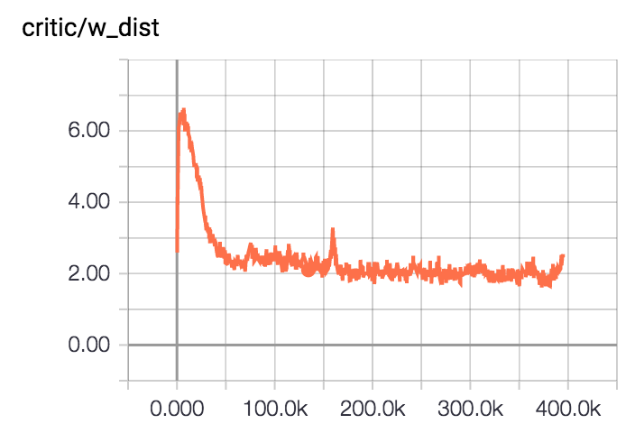
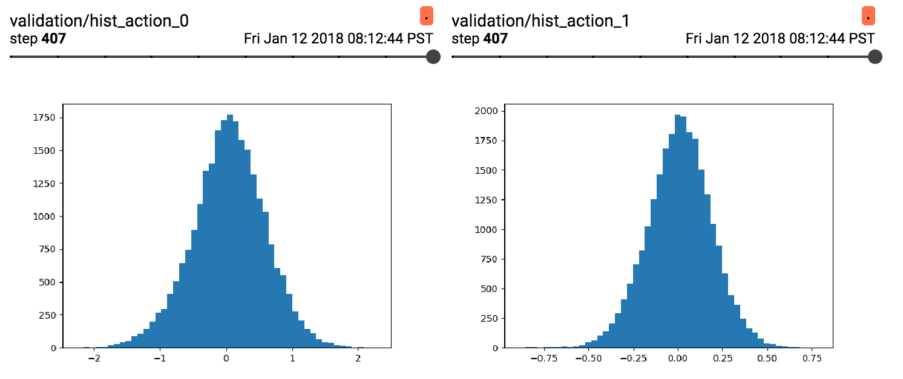

## Training Walkthrough
- This section describes running, monitoring, and validating an experiment

### Running
- use the `scripts/imitation/imitate.py` script
- when you run this script, it creates a directory in `data/experiments`
    + this directory will contain all the information related to this experiment with the following structure
        * imitate/
            - log/
                + saved network parameters
                + log.txt file 
                + saved args
            - summaries/
                + tensorflow summaries, more on this in a bit
        * viz/
            - directory containing automatically generated renderings of the environment
- see `scripts/imitation/hyperparams.py` for default hyperparameters

### Monitoring
- there's a pretty extensive [tensorboard] (https://www.tensorflow.org/get_started/summaries_and_tensorboard) associated with the `imitate.py` script
- if you're interested in how it works, see the file `scripts/imitation/auto_validator.py`
- in practice, run it by navigating to the summaries directory as specified above and executing `tensorboard --logdir=. --port 55555`, where `55555` is just some random port not in use

#### Examples
- here are some examples of the information available on tensorboard
- the section titles below are the same as the tabs available in tensorboard

##### Critic
- the GAIL implementation (not included in this repo) summarizes information loss, etc
- probably the most helpful value is the wasserstein distance (assuming you're using [wgan](https://arxiv.org/abs/1701.07875), which by default you will be)
- here's an example plot:
    + the wgan paper argues that wasserstein distance is a good indicator of performance (with decreasing wasserstein distances associated with improving performance), and in my experience this is the case. See the paper for details.
    + note that the w-distance stops improving here 
        * this is an indicator that either (a) the critic is much more expressive than the policy or that it is being trained for much longer with a low gradient penalty or (b) that there's a bug 
        * in this case, I believe it's because of option (a)

##### Comparison
- how you normalize the observations and actions when running GAIL is an important detail
- these plots show the difference between the mean values observed by the agent during training and the mean values of the expert data
- because these are normalized differently, we want all the mean plots to be as close to zero as possible, but in practice they tend not to be 
- the std deviation plots are also there, and in that case we just want them to be equal
- if something seems to not be working, look through these plots (there are a lot of them)

##### Reward Handler
- there is a class responsible for merging external rewards called RewardHandler
- it summarizes stats about the different external rewards

##### Validation 
- this tab includes validation information 
- for example the rmse wrt various attributes and the frequency of collisions

##### Images
- at the top of tensorboard is an images tab
- clicking on that shows, among other images, histograms of the actions output by the agent
- because these are normalized between -1 and 1, the values should typically lie in that range, though may be larger

## Validating
- after training a policy, you can validate it using the `scripts/imitation/validate.py` script
- see the script for details